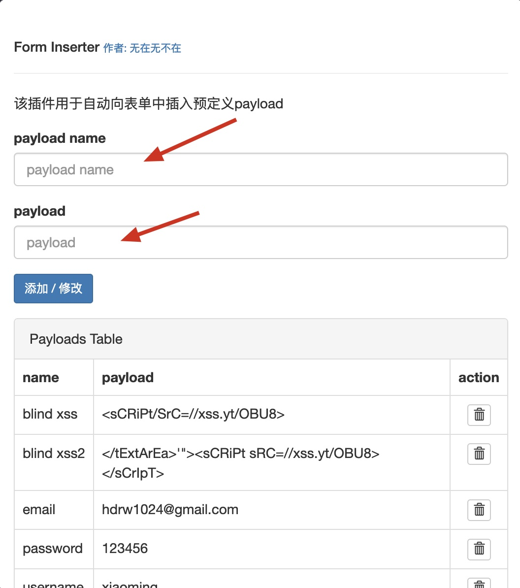

# Form Inserter 

一款用于向表单中自动插入预定义payload 的Firefox浏览器插件
<!-- ## 下载地址
```
https://addons.mozilla.org/zh-CN/firefox/addon/form-inserter/
``` -->
## 使用方法

step1 添加你的payload 



step2. 打开右键菜单，选择payload name, 插件便会自动向当前页面所有的input框和textarea框插入对应的payload  

 


如果当前用户选中的是一个input框/textarea框，则只会在选中的input/textarea 框中插入payload。

## 参与开发

方法一:
```
about:debugging 
```
点击`临时加载附加组件`，选中该插件的 mainfest.json 文件即可


方法二:
```
sudo npm install --global web-ext
```
```
web-ext run 
```


## 技术支持
### QQ 交流群


### 微信公众号
